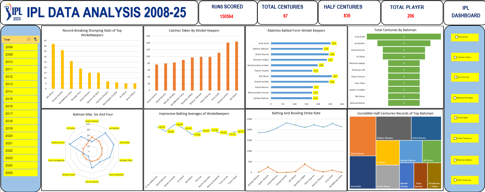

# 📊 IPL 2025 Data Analysis

A comprehensive analysis of **Indian Premier League (IPL)** data from **2008 to 2025**, visualized using advanced Excel dashboards. This project extracts deep insights from the dataset including runs, centuries, wickets, stumping, averages, and more, offering valuable trends and stats for cricket enthusiasts, analysts, and developers.

---

## 📁 Dataset

All raw and processed data is available in the file:

```
IPL_2025_Data_Analysis.xlsx
```

It contains structured data across multiple sheets including:

* Match statistics
* Player performances
* Batting and bowling averages
* Wicketkeeping records
* Year-wise trends

---

## 📌 Key Insights Visualized

✅ **Total Runs Scored**: `150,564`
✅ **Total Centuries**: `67`
✅ **Half Centuries**: `839`
✅ **Total Players**: `206`

### 🔍 Breakdown of Dashboard Panels:

* **Record-Breaking Stumping Stats of Top Wicketkeepers**
* **Catches Taken by Wicketkeepers**
* **Matches Batted by Wicketkeepers**
* **Total Centuries by Batsmen**
* **Half-Century Records of Top Batsmen**
* **Batting vs Bowling Strike Rate Comparison**
* **Impressive Batting Averages of Wicketkeepers**
* **Radar Chart: Players with Maximum Sixes & Fours**
* **Year-Wise Data Navigation**

---

## 🛠 Tools Used

* **Microsoft Excel** – Data cleaning, transformation, and dashboard creation
* **Power Query** – Data import and processing
* **Pivot Tables & Charts** – Visual summaries and analysis

---

## 📸 Dashboard Preview



---

## 💡 How to Use

1. Download the `IPL_2025_Data_Analysis.xlsx` file.
2. Open in Excel (preferably 2016 or later for full compatibility).
3. Use slicers and filters to explore year-wise stats and player comparisons.
4. Modify or update sheets with new data for future seasons.

---

## 👨‍💻 Author

**Himanshu** – B.Tech Final Year Student, passionate about data analytics and cricket.
Department: **Information Technology, GNIOT**
